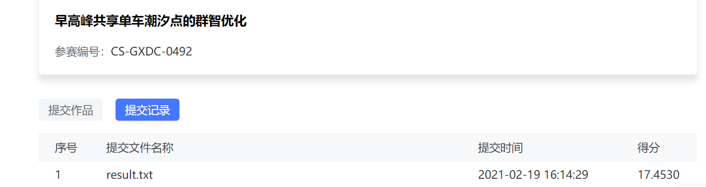

# Baseline

代码：https://cdn.coggle.club/dcic2021/DCIC-baseline.html
提交方法：https://data.xm.gov.cn/contest-series-api/file/period_id_1/userGuide.pdf

baseline提交



## 题目

### 数据

共享单车轨迹数据2021年1月21日到25日

共享单车停车点位(电子围栏)数据

共享单车订单数据


### 任务

- `赛题说明`

共享单车，延伸了城市公共交通脉络，解决了市民出行“最后一公里”问题。然而，随着共享经济模式被越来越多市民接受，成为出行习惯，潮汐现象也随之出现。白天工作、晚上休息的人类活动规律的客观存在，加之上下班时间段的集中，导致早晚高峰“一车难寻”、“无地可停”的供需矛盾。本题希望通过对车辆数据的综合分析，对厦门岛内早高峰阶段潮汐点进行有效定位，进一步设计高峰期群智优化方案，缓解潮汐点供需问题，以期为城市管理部门和共享单车运营方研究制定下一步优化措施提供数据支撑。

- `赛题说明`

任务一：为更好地掌握早高峰潮汐现象的变化规律与趋势，参赛者需基于主办方提供的数据进行数据分析和计算模型构建等工作，**识别出工作日早高峰07:00-09:00潮汐现象最突出的40个区域**，列出各区域所包含的共享单车停车点位编号名称，并提供计算方法说明及计算模型，为下一步优化措施提供辅助支撑。

任务二：参赛者根据任务一Top40区域计算结果进一步**设计高峰期共享单车潮汐点优化方案，通过主动引导停车用户到邻近停车点位停车**，进行削峰填谷，缓解潮汐点停车位（如地铁口）的拥堵问题。允许参赛者自带训练数据，但需在参赛作品中说明所自带数据的来源及使用方式，并保证其合法合规。（城市公共自行车从业者将发生在早晚高峰时段共享单车“借不到、还不进”的问题称之为“潮汐”现象。本题涉及的“潮汐现象”聚焦“还不进”的问题，识别出早高峰共享单车最淤积的40个区域）

## 相关包

```python
import os, codecs
import pandas as pd
import numpy as np

%pylab inline
from IPython.display import set_matplotlib_formats
set_matplotlib_formats('svg')

import matplotlib.pyplot as plt

from matplotlib import font_manager as fm, rcParams
#font_manager管理字体；rc.Params主要作用为指定图片像

import geohash
from geopy.distance import geodesic

import hnswlib

from geopy.distance import geodesic
```

pandas、numpy、matplotlib是常用的数据分析包

地址编码工具箱geopy(能根据经纬度算距离）


### geohash

Geohash是一个Python模块，它提供了在纬度和经度坐标之间解码和编码Geohashes的函数。可调用`decode()`和`encode()`函数。

#### 引言

GeoHash本质上是空间索引的一种方式，其基本原理是将地球理解为一个二维平面，将平面递归分解成更小的子块，每个子块在一定经纬度范围内拥有相同的编码。以GeoHash方式建立空间索引，可以提高对空间poi数据进行经纬度检索的效率。

#### 认识geohash

GeoHash将二维的经纬度转换成字符串，比如下图展示了北京9个区域的GeoHash字符串，分别是WX4ER，WX4G2、WX4G3等等，每一个字符串代表了某一矩形区域。也就是说，这个矩形区域内所有的点（经纬度坐标）都共享相同的GeoHash字符串，这样既可以保护隐私（只表示大概区域位置而不是具体的点），又比较容易做缓存。


 Geohash编码中，字符串相似的表示距离相近，这样可以利用字符串的前缀匹配来查询附近的POI信息。

#### geohash算法

以经纬度值：（116.389550， 39.928167）进行算法说明，对纬度39.928167进行逼近编码 (地球纬度区间是[-90,90]

  a. 区间[-90,90]进行二分为[-90,0),[0,90]，称为左右区间，可以确定39.928167属于右区间[0,90]，给标记为1

  b. 接着将区间[0,90]进行二分为 [0,45),[45,90]，可以确定39.928167属于左区间 [0,45)，给标记为0

  c. 递归上述过程39.928167总是属于某个区间[a,b]。随着每次迭代区间[a,b]总在缩小，并越来越逼近39.928167

  d. 如果给定的纬度x（39.928167）属于左区间，则记录0，如果属于右区间则记录1，序列的长度跟给定的区间划分次数有关。

   e. 同理，地球经度区间是[-180,180]，可以对经度116.389550进行编码。通过上述计算，	纬度产生的编码为1 1 0 1 0 0 1 0 1 1 0 0 0 1 0，经度产生的编码为1 0 1 1 1 0 0 0 1 1 0 0 0  1 1。

​    f. 合并：偶数位放经度，奇数位放纬度，把2串编码组合生成新串。

​    g. 首先将11100 11101 00100 01111 0000  01101转成十进制，对应着28、29、4、15，0，13 十进制对应的base32编码就是wx4g0e。

​     h. 同理，将编码转换成经纬度的解码算法与之相反


 Geohash其实就是将整个地图或者某个分割所得的区域进行一次划分，由于采用的是base32编码方式，即Geohash中的每一个字母或者数字（如wx4g0e中的w）都是由5bits组成（2^5 = 32，base32），这5bits可以有32中不同的组合（0~31），这样我们可以将整个地图区域分为32个区域，通过00000 ~ 11111来标识这32个区域。

#### 使用注意

 a. 由于GeoHash是将区域划分为一个个规则矩形，并对每个矩形进行编码，这样在查询附近POI信息时会导致以下问题，比如红色的点是我们的位置，绿色的两个点分别是附近的两个餐馆，但是在查询的时候会发现距离较远餐馆的GeoHash编码与我们一样（因为在同一个GeoHash区域块上），而较近餐馆的GeoHash编码与我们不一致。这个问题往往产生在边界处。


解决的思路很简单，我们查询时，除了使用定位点的GeoHash编码进行匹配外，还使用周围8个区域的GeoHash编码，这样可以避免这个问题。

  b. 我们已经知道现有的GeoHash算法使用的是Peano空间填充曲线，这种曲线会产生突变，造成了编码虽然相似但距离可能相差很大的问题，因此在查询附近餐馆时候，首先筛选GeoHash编码相似的POI点，然后进行实际距离计算。

  c. GeoHash Base32编码长度与精度。当geohash base32编码长度为8时，精度在19米左右，而当编码长度为9时，精度在2米左右，编码长度需要根据数据情况进行选择。


### [hnswlib](https://github.com/nmslib/hnswlib)

HNSW——Hierarchical NSW (分层的NSW算法)，是近似k近邻搜索中的新方法，也是对NSW方法的改进，它由多层的邻近图组成，因此称为分层的NSW方法。

#### NSW的搜索机制


首先在这张图中有六个地点，每一个点代表一个机场，而点的大小表示了这个机场的规模。现在我们要从Toksook bay出发，目的地是Ibaza，那么首先，我们在Toksook bay附近找到了**距离Ibaza最近**的机场Bethel，之后，我们在Bethel附近找**距离Ibaza**最近的机场，最终我们找到了Anchorage，然后接着在Anchorage附近找**距离Ibaza最近**的机场，…，最后，我们找到了Ibaza。NSW的搜索机制就是这样的，在base node（Toksook bay）的近邻中找到与query（Ibaza）最近的点，然后把这个点更新为新的base node，再重复以上过程，直到找到query。

搜索分为两个阶段，缩小和放大阶段。我们从节点度小（机场规模小）的节点开始搜索，然后逐渐找到节点度大的节点，这是**缩小阶段（粗略搜索）**，它能够让我们一步走很多，加快了搜索速度。找节点度大的节点的好处是它的连接数量多，能够有更多的选择，在这里，它也被称为网络中的枢纽节点。当枢纽节点与我们的query距离较近时，我们又开始搜索周围节点度小的节点，这是**放大阶段（精细搜索）**。

#### HNSW的改进方法：

- 使用了分层的结构，根据特征半径分层，每一个元素的层$l =  - \ln (unif(0,1)) \times {m_L}$。这样看来，每个元素的层次似乎是随机的，但其实，作者在论文中提到，${m_L} = 1/\ln (M)$是最佳选择(有实验数据证明)，而M是每个元素的最大连接数，因此这也就保证了高层节点有较大的节点；
- 使用了一种启发式方法选择某节点的邻居。

### 安装包

`geohash`

pip install geohash可以直接安装这个库，可是装好之后import geohash却报错。

**解决办法**：

1. 去Lib/site-packages/目录下，把Geohash文件夹重命名为geohash
2. 修改该目录下的__init__.py文件，把from geohash改为from .geohash


`hnswlib`

hnswlib是不可以直接pip install的

1.出现：Microsoft Visual C++ 14.0 is required 

[安装 Microsoft visual c++ 14.0](https://964279924.ctfile.com/fs/1445568-239446865)

2.安装pybind11

pip3 install pybind11 numpy setuptools

3.[下载hnswlib](https://github.com/nmslib/hnswlib)

在python_bindings文件夹下执行

python ../setup.py install


可能会报如下的错：

LINK : fatal error LNK1104: 无法打开文件“ucrtd.lib

> C:\Program Files (x86)\Windows Kits\10\Lib

到上面的文件夹中，将低版本里的ucrtd文件夹复制到高版本里。


“corecrt.h”: No such file or directory

> C:\Program Files (x86)\Windows Kits\10\Include

到上面的文件夹中，将低版本里的ucrtd文件夹复制到高版本里。


## 代码解读

### 读取数据集

主要利用DataFrame.apply()函数来对原始数据进行转化，将经纬度转换为geohash，二维的经纬度转换成字符串。

将`围栏的区域、中心点`计算出来。

### 按照经纬度聚合

用到了python中的pivot_table，数据透视表，以前都是在EXCEL中使用，这是第一次直到python的数据透视表。

> pivot_table(data, values=None, index=None, columns=None,aggfunc='mean', fill_value=None, margins=False, dropna=True, margins_name='All')

pivot_table有四个最重要的参数index、values、columns、aggfunc.

分别是行，值，列，计算方法。


在对入流量和出流量进行可视化以后，可以看到会有特殊日子出现，12月25日是圣诞节，会对数据产生影响。

geohash编码的缺陷是：如果非常精确，单车停的位置和停车点有一点误差也会让彼此识别不到。

### 距离匹配计算潮汐

将订单最近的地方作为停车点。

使用knn或者hnswlib来进行搜索。

密度计算使用：留存量/停车点大小。

## 改进方向

关于密度计算方式：留存量/停车点大小


停车点的大小：

```
count    14071.000000
mean         8.178492
std          4.042660
min          2.448467
25%          5.779223
50%          7.113295
75%          9.457627
max         86.090953
Name: FENCE_AREA, dtype: float64
```

```
5361     86.090953
11159    72.984383
11432    50.791688
11436    51.136642
13475    61.268254
13910    56.184176
Name: FENCE_AREA, dtype: float64
```

可以看到大小还是差别挺大的。


停车点有1万4千多个，那么可以不可以先考虑把大部分的都先筛出掉，然后对100、200多个有可能的地方进行其他密度计算方式，

 

没有使用共享单车的轨迹数据，轨迹数据和订单数据之间的单车编号不能进行匹配。

可以根据单车的徘徊情况来增加判断的维度（如果单车在某些区域徘徊，是不是就意味着找不到停车点。）


可视化单车轨迹热力图、路线图来进一步寻找规律。


考虑一些其他情况，比如地铁口、公交站。