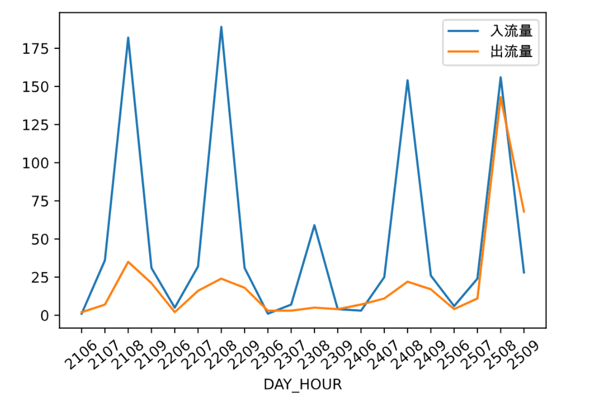
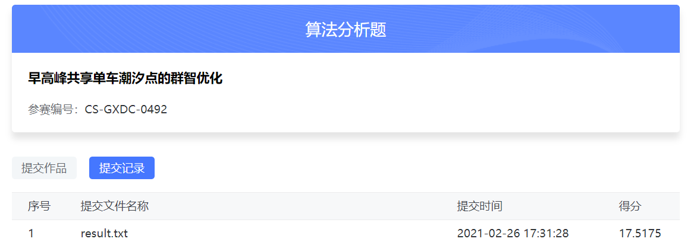

# Try

代码：https://cdn.coggle.club/dcic2021/DCIC-baseline.html
提交方法：https://data.xm.gov.cn/contest-series-api/file/period_id_1/userGuide.pdf

## Baseline的一些改进

### 停车点数量问题

题目中，需要我们找出40个有潮汐现象的区域，这些`区域有的停车点不止40个`，baseline里选择了计算密度最大的前100个停车点作为最后的结果，默认前100个停车点所对应那40个有潮汐现象的区域。

同时，在计算出入流量之差时，将小于0的都算为0，但检查后发现只有91个大于0，那么后面9个停车点其实和其他所有停车点其实在密度这方面没有差别。

```python
bike_fence.loc[(bike_fence['FENCE_ID'].isin(bike_density['index'][:100])&(bike_fence['DENSITY']>0)),['FENCE_ID','DENSITY']]
```

91 rows × 2 columns


首先将停车点改为90个，查看得分。

 从17.4530降低到了17.3842

得分反而稍微降低。


### 密度计算问题

或者我们可以重新定义一下密度计算，

bike_remain = (bike_inflow - bike_outflow).fillna(0)因为有些区域没有订单，所以设为0

将bike_remain[bike_remain < 0] = 0  注释后

bike_remain.describe()

```
count     221.000000
mean     -612.063348
std      1023.371929
min     -4755.000000
25%     -1045.000000
50%      -197.000000
75%         0.000000
max      2149.000000
dtype: float64
```

可以看到`绝大多数的区域，入流量都是要小于出流量的`，我们可以认为，除了单车订单使得车辆流动，共享单车的公司也会派人去进行车辆空间转移，使得需求大的地方有车可以用。

然而很不幸的，结果还是17.4530


### 订单时间问题

我们可以发现25号其实是一个特殊的日子：圣诞节，这一天的数据比较特殊，我们尝试将这一天的数据先不计算，只通过前面更普遍的日期来计算潮汐点。



注意这里columns=['DAY_HOUR']，所以是bike_remain.iloc[:,:16]

```python
bike_inflow = pd.pivot_table(bike_order[bike_order['LOCK_STATUS'] == 1], 
                   values='LOCK_STATUS', index=['geohash'],
                    columns=['DAY_HOUR'], aggfunc='count', fill_value=0
)

bike_outflow = pd.pivot_table(bike_order[bike_order['LOCK_STATUS'] == 0], 
                   values='LOCK_STATUS', index=['geohash'],
                    columns=['DAY_HOUR'], aggfunc='count', fill_value=0
)

bike_remain = (bike_inflow - bike_outflow).fillna(0)
#bike_remain[bike_remain < 0] = 0  
bike_remain = bike_remain.iloc[:,:16].sum(axis = 1)
bike_fence['DENSITY'] = bike_fence['geohash'].map(bike_remain).fillna(0)
```

这里columns=['DAY']，所以是bike_remain.iloc[:,:5]

```python
bike_inflow = pd.pivot_table(bike_order[bike_order['LOCK_STATUS'] == 1], 
                   values='LOCK_STATUS', index=['fence'],
                    columns=['DAY'], aggfunc='count', fill_value=0
)

bike_outflow = pd.pivot_table(bike_order[bike_order['LOCK_STATUS'] == 0], 
                   values='LOCK_STATUS', index=['fence'],
                    columns=['DAY'], aggfunc='count', fill_value=0
)

bike_remain = (bike_inflow - bike_outflow).fillna(0)
#bike_remain[bike_remain < 0] = 0  
bike_remain = bike_remain.iloc[:,:5].sum(axis = 1)
```



稍微提高了0.06

。。。。。。

也还行吧。